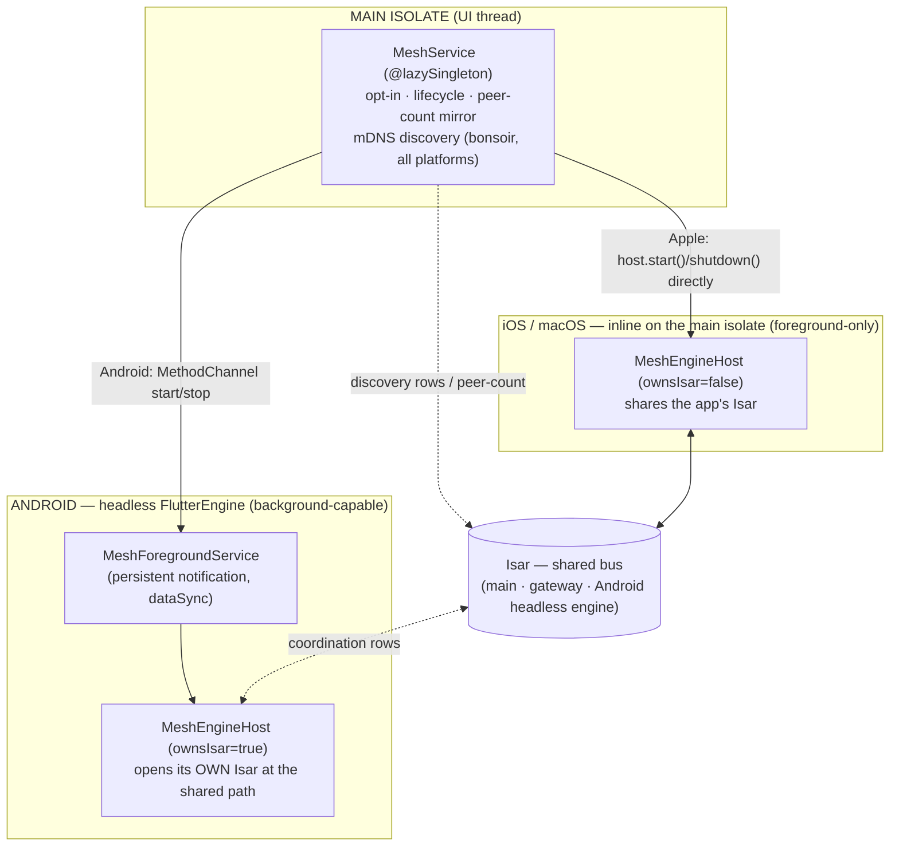
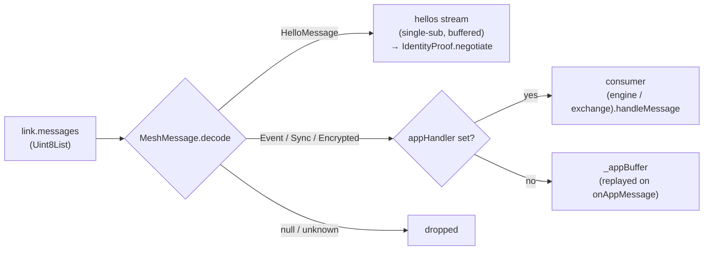
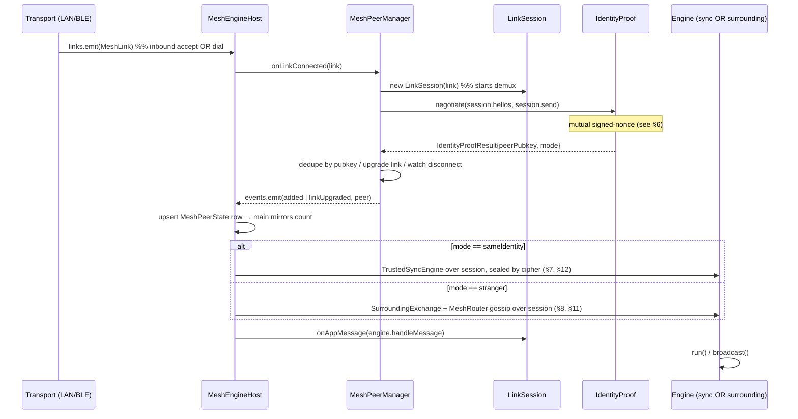
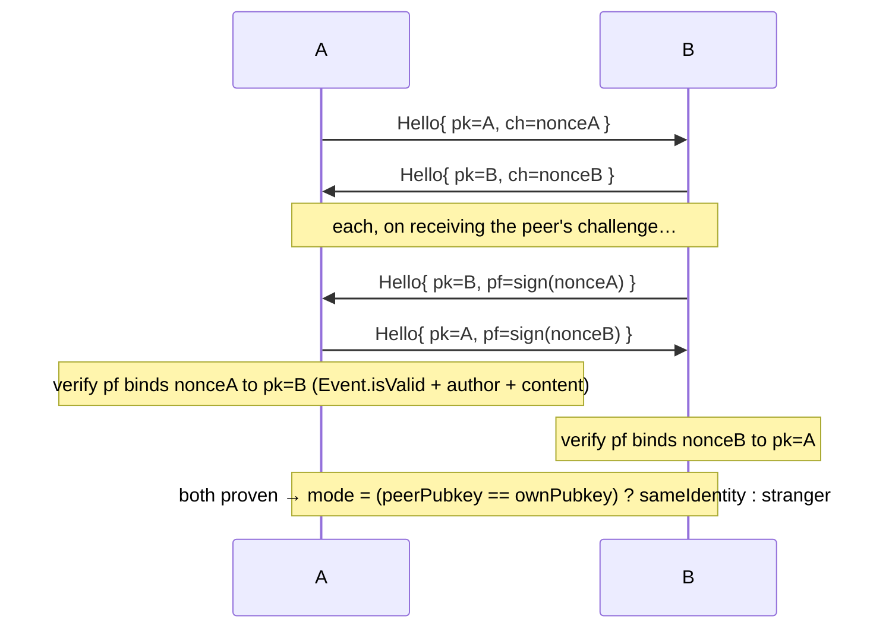
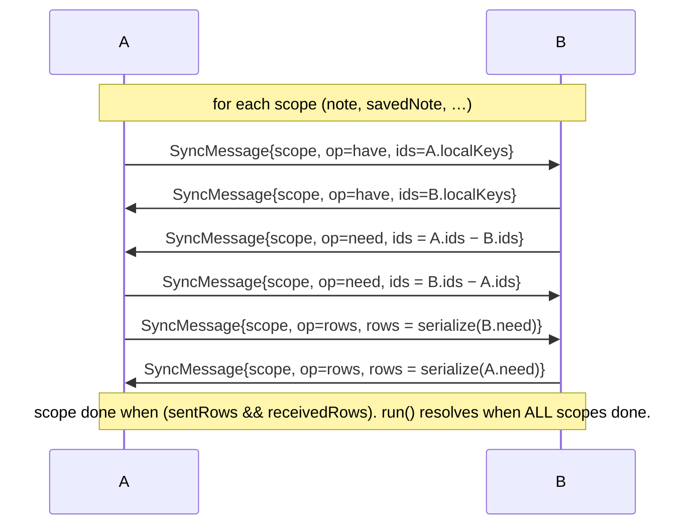
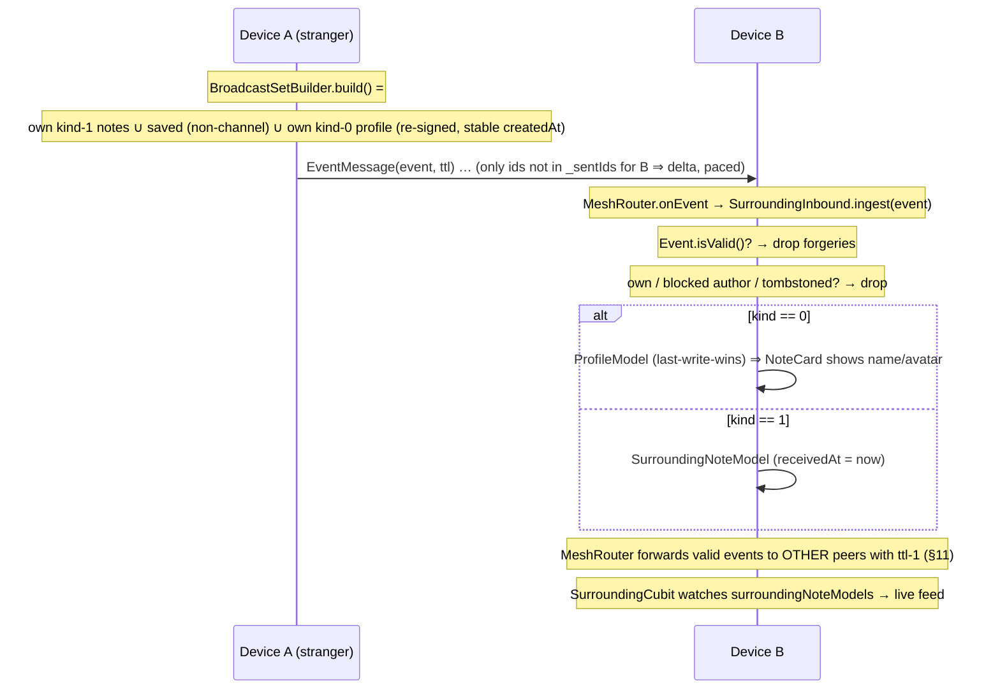
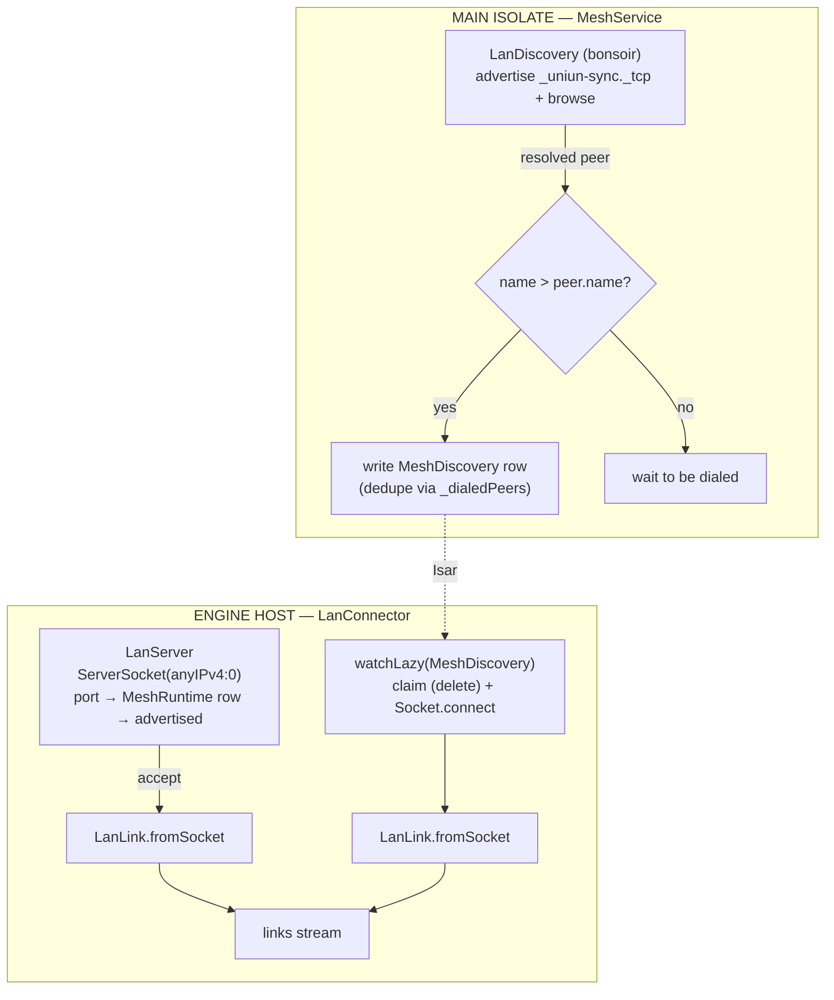
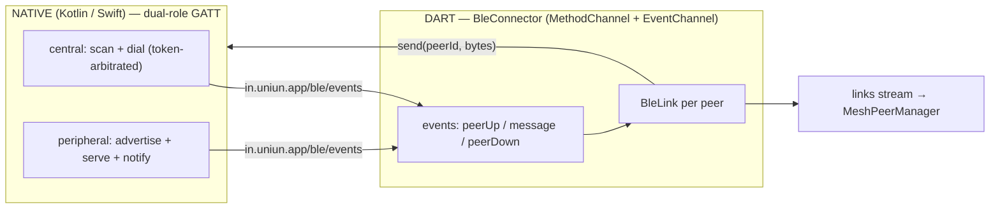
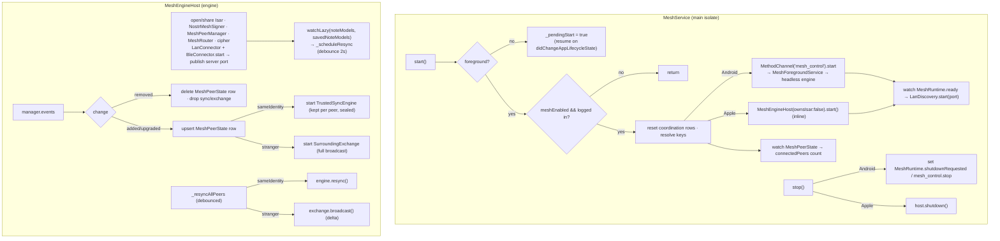

# UNIUN Mesh — Low-Level Design

Offline, multi-transport peer-to-peer layer that lets UNIUN work **without internet**
by exchanging Nostr data directly with nearby devices.

It delivers two user-facing capabilities over the **same** application stack:

1. **Same-identity multi-device sync** — two devices on the same `nsec`, in range,
   reconcile *all* their local content (notes, channels, DMs, bookmarks, follows,
   blocks, profiles, deletion tombstones) over an **encrypted** channel.
2. **Surrounding feed** — devices with *different* identities broadcast their public
   notes to nearby strangers; received notes land in an ephemeral "📍 Nearby" feed
   that's evicted daily. Public events also **gossip** multi-hop beyond direct range.

Which one runs is decided **automatically** by a cryptographic handshake: same proven
pubkey → *sync*, different pubkey → *surrounding*.

> Status: **LAN/Wi-Fi and BLE transports are built and device-verified**, multi-hop TTL
> gossip and same-identity channel encryption are built, and **Android background
> execution** runs via a foreground service. The engine is hosted differently per
> platform (headless `FlutterEngine` on Android, inline on Apple — see
> [§1](#1-layered-architecture)). Multipeer and a general iOS background story remain
> future scope — see [§18](#18-not-yet-built).

---

## 1. Layered architecture

Everything is **transport-agnostic** above a thin seam (`MeshLink`). The application
logic (handshake, sync engine, surrounding exchange, gossip) never knows whether it's
running over Wi-Fi, BLE, or (future) Multipeer.

The whole engine lives in `MeshEngineHost` — **identical code on every platform**. Only
its *host* differs, and that single divergence is captured by two flags:
`MeshService._inline` (which host to use) and `MeshEngineHost.ownsIsar` (whether teardown
closes Isar).



**Why the split.** The engine needs to keep running while the app is **backgrounded**,
which only Android offers a general mechanism for (a foreground service). So:

- **Android** runs `MeshEngineHost` inside a **headless `FlutterEngine`** hosted by
  `MeshForegroundService`. The entry point is `meshEngineMain` in `lib/main.dart` (must be
  a **root-library**, `@pragma('vm:entry-point')` function) → `runMeshEngine()` in
  `mesh_engine_main.dart`. It opens its **own** Isar at the shared path (`ownsIsar = true`),
  reads the identity from secure storage, and runs mDNS + LAN + BLE. `MeshService` drives it
  over `MethodChannel('in.uniun.app/mesh_control')` (`start`/`stop`); the engine exposes a
  control surface over `MethodChannel('in.uniun.app/mesh_engine')` for graceful `shutdown`.
- **iOS / macOS** run `MeshEngineHost` **inline on the app's main isolate** — there is **no
  second engine**. `package:objective_c` (pulled in transitively by `path_provider`'s newer
  versions) corrupts/crashes with multiple `FlutterEngine`s in one process, so a second
  engine is off the table on Apple. `MeshService` constructs
  `MeshEngineHost(_isar, ownsIsar: false)` directly and calls `host.start()` / `host.shutdown()`.
  Native BLE (`UniunBleMesh`, CoreBluetooth) is registered on the **main** engine in
  `AppDelegate` / `MainFlutterWindow`. `runMeshEngine` / `meshEngineMain` / `mesh_control` are
  unused on Apple.

Both share the **two isolates coordinate purely through Isar** discipline that the Gateway
uses: discovery endpoints, a runtime control row, and the connected-peer count travel through
Isar — never a `SendPort`. (On Apple this is moot — it's the same isolate — but the code is
identical.)

> **`path_provider` pin (do not remove).** `path_provider_foundation` is pinned to `2.5.1` in
> `pubspec.yaml` `dependency_overrides`. v2.6+ switched to `package:objective_c` (FFI), which is
> unstable in this app on Apple and was the root cause of recurring `EXC_BAD_ACCESS` crashes. The
> mesh engine on Apple therefore runs `DartPluginRegistrant` on **Android only** and relies on
> native `GeneratedPluginRegistrant` + method-channel defaults elsewhere.

**The seam.** `abstract class MeshLink` is a reliable, ordered, *message-framed* channel to one
peer. Each `messages` item is exactly one whole application message (the transport owns framing).
Every transport implements it; the layers above are identical regardless of which transport won.

---

## 2. Directory map

```
lib/main.dart                         meshEngineMain (@pragma vm:entry-point, Android headless)
lib/features/mesh/
├── mesh_constants.dart           all tuning knobs (TTL, caps, timeouts, pacing, eviction)
├── link/
│   ├── mesh_link.dart            MeshLink, TransportKind, MeshLinkState
│   ├── mesh_peer.dart            MeshPeer, PeerMode
│   └── link_session.dart         per-link demux (Hello vs Event/Sync)
├── payload/
│   └── payload_envelope.dart     MeshMessage {Hello,Event,Sync,Encrypted} wire format
├── handshake/
│   ├── identity_proof.dart       MeshSigner + IdentityProof (signed-nonce)
│   └── nostr_mesh_signer.dart    real secp256k1/Schnorr signer (kind 27492)
├── negotiator/
│   └── mesh_peer_manager.dart    dedupe by pubkey, link upgrade, disconnect
├── router/
│   └── mesh_router.dart          multi-hop TTL gossip (seen-set dedup + forward)
├── security/
│   └── same_identity_cipher.dart HKDF-SHA256 → ChaCha20-Poly1305 channel cipher
├── service/
│   └── mesh_service.dart         @lazySingleton MAIN-isolate controller:
│                                 lifecycle (Android FGS / Apple inline) + mDNS + peer-count
├── engine/
│   ├── mesh_engine_host.dart     MeshEngineHost — the engine (transports, negotiator,
│   │                             sync/surrounding sessions, gossip, cleanup)
│   ├── mesh_engine_main.dart     runMeshEngine() — Android headless-engine entry body
│   └── mesh_identity.dart        reads nsec from secure storage; derives pubkey
├── transport/
│   ├── mesh_transport.dart       MeshTransport seam (implemented by LanConnector/BleConnector)
│   ├── lan/
│   │   ├── lan_framer.dart        length-prefix framing (4-byte BE)
│   │   ├── lan_link.dart          LanLink (Socket) implements MeshLink
│   │   ├── lan_server.dart        ServerSocket
│   │   ├── lan_discovery.dart     bonsoir mDNS advertise/browse  (MAIN isolate)
│   │   └── lan_connector.dart     LanConnector: server + Isar-driven dial
│   └── ble/
│       ├── ble_connector.dart     BleConnector: native dual-role bridge → MeshLink
│       └── ble_link.dart          BleLink (one GATT peer) implements MeshLink
├── sync/                         SAME-IDENTITY reconciliation
│   ├── sync_scope.dart           SyncScope contract
│   ├── trusted_sync_engine.dart  id-list diff (HAVE/NEED/ROWS), re-runnable (resync)
│   ├── trusted_sync_scopes.dart  the 8 scopes registry
│   └── scopes/                   note / savedNote / deletedNote / dmConversation /
│                                 profile / followedUser / followedNote / blockedUser
└── surrounding/                  STRANGER broadcast
    ├── broadcast_event.dart        canonical event reconstruction
    ├── broadcast_set_builder.dart  own+saved notes + own profile (capped, delta cursor)
    ├── surrounding_inbound.dart    verify + store (kind 1 → note, kind 0 → profile)
    ├── surrounding_exchange.dart   per-peer delta broadcast (paced)
    └── surrounding_cleanup.dart    daily eviction

Native BLE (one custom byte-pipe per platform, byte-compatible on the wire):
  android/app/src/main/kotlin/in/uniun/app/
    ├── MeshForegroundService.kt   hosts the headless FlutterEngine + BleController
    ├── MainActivity.kt            mesh_control channel + runtime BLE/notification perms
    └── ble/  BleUuids · BleCommon · BleController · BleFragmenter · BleCentral · BlePeripheral
  ios/Runner/UniunBleMesh.swift    shared CoreBluetooth dual-role impl (see §10)
    └── AppDelegate.swift / macos/Runner/MainFlutterWindow.swift register it on the main engine

lib/data/models/surrounding_note_model.dart    ephemeral cache (receivedAt eviction)
lib/data/models/mesh/mesh_discovery_model.dart  main→engine dial hand-off (claim+delete)
lib/data/models/mesh/mesh_peer_state_model.dart engine→main connected-peer rows (count)
lib/data/models/mesh/mesh_runtime_model.dart    single-row control (server port / shutdown)
lib/data/models/dm/dm_conversation_model.dart   Id = fastHash(otherPubkey)  ← deterministic
lib/core/utils/fast_hash.dart                   FNV-1a 64-bit
lib/domain/repositories/surrounding_note_repository.dart  (+ impl)  UI read/promote
lib/features/surrounding/                       cubit + page (NoteCard)
lib/features/settings/widgets/mesh_card.dart    opt-in toggle + live peer count
```

---

## 3. The transport seam

```dart
enum TransportKind { lan, multipeer, ble, relay }   // preference: lan>multipeer>ble>relay
enum MeshLinkState { connecting, connected, disconnected }

abstract class MeshLink {
  String get linkId;                 // transport-local id (host:port / peripheral id)
  TransportKind get transportKind;
  Stream<Uint8List> get messages;    // one whole app message per item (single-subscription)
  Stream<MeshLinkState> get states;
  bool get isConnected;
  void send(Uint8List message);      // transport frames it
  Future<void> close();
}
```

`MeshLink.messages` is **single-subscription** (mirrors a paused socket: it buffers until
read). Exactly one consumer reads it — the `LinkSession` demux.

A `MeshTransport` (LAN / BLE / future Multipeer) advertises + discovers and surfaces every
freshly-established connection as a `MeshLink` on its `links` stream. `MeshEngineHost` wires
each transport's `links` into the negotiator the same way, so adding a transport is one more
entry in the host's transport list — nothing above the seam changes.

### LinkSession — the demux

A `MeshLink` carries two conceptually different streams: the **handshake** (Hello messages) and
the **post-handshake app traffic** (Event/Sync/Encrypted). Both must share the one
single-subscription link stream. `LinkSession` owns it and routes:



- `hellos` buffers until the negotiator subscribes (it attaches asynchronously inside
  `IdentityProof.negotiate`), so the opening Hello is never dropped.
- App messages arriving *during* the handshake are buffered and replayed when the post-handshake
  consumer registers via `onAppMessage(handler)`.
- Post-handshake Hellos are ignored (the app phase has started).

---

## 4. Wire format

Every link message is one UTF-8 JSON object `{"v":1,"t":<type>,...}`. `decode` is tolerant —
malformed / wrong-version / unknown-type → `null` (dropped, never throws).

```
sealed MeshMessage (v=1)
├── HelloMessage     t="hello"  { pk, ch?(challenge nonce), pf?(signed proof event) }
├── EventMessage     t="event"  { e: <raw Nostr event JSON>, ttl }   ← surrounding + sync rows + gossip
├── SyncMessage      t="sync"   { s:scope, op, ids?[], rows?[] }      ← same-identity diff
└── EncryptedMessage t="enc"    { c: <base64 ChaCha20-Poly1305 sealed inner MeshMessage> }
                                op ∈ { have, need, rows, done }
```

`EventMessage.ttl` carries the remaining multi-hop forward budget (`kMeshMaxTtl = 7`); only the
gossip relay reads it. `EncryptedMessage` wraps a sealed inner `MeshMessage` and is used **only**
on the same-identity sync path (Hello + surrounding stay plaintext) — see [§12](#12-same-identity-channel-encryption).

### LAN framing (`lan_framer.dart`)

TCP is a byte stream with no message boundaries, so each `MeshMessage` is wrapped:

```
┌────────────┬──────────────────────────────┐
│ len (4B BE)│ payload (the encoded message) │   len ≤ kMeshMaxMessageBytes (8 MB)
└────────────┴──────────────────────────────┘
```

`LanFrameDecoder` is a stateful re-assembler: feed it raw socket chunks (split anywhere), it
yields each complete message exactly once, buffering partial headers/payloads across chunks.
BLE has its **own** fragmentation layer ([§10](#10-ble-transport)); above the seam neither is visible.

---

## 5. Connection lifecycle

All participants below run **inside `MeshEngineHost`** (Android headless engine / Apple main
isolate). The main isolate's `MeshService` only feeds discovery: `LanDiscovery` resolves a
peer → writes a `MeshDiscovery` row → `LanConnector` claims it and dials (or accepts an inbound
socket). BLE discovery + dialing happen natively and surface as ready `BleLink`s.



---

## 6. Identity handshake (`identity_proof.dart`)

A **mutual signed-nonce challenge** proves each side controls the private key behind its claimed
pubkey, and decides the peer mode. The nonce needs *freshness* (anti-replay), not secrecy — the
signature proves key control regardless of who reads it.



The signer is abstracted (`MeshSigner`) so the handshake state machine is unit-tested with a fake.
The production `NostrMeshSigner` signs an **ephemeral kind 27492** event whose `content` is the
challenge, and verifies via `Event.fromJson(verify:false)` + `event.isValid()`
(`Event.fromJson(verify:true)` only `assert`s, which is stripped in release — so we check the
boolean ourselves) + author match + content == challenge.

> Privacy: the pubkey is **never** advertised in the clear (no pubkey in the mDNS TXT or the BLE
> advertisement). It's exchanged only inside the post-connect handshake.

> Hardening noted: over an unencrypted LAN socket a MITM could relay a challenge to the real
> key-holder. Channel binding (TLS) and a BLE Noise channel close this; tracked for a later phase.

---

## 7. Same-identity sync (`sync/`)

### Protocol — symmetric id-list diff

Per `SyncScope`, in both directions. Terminates even for empty scopes.



`TrustedSyncEngine` is **trusted** — the channel is authenticated to the same identity (and
encrypted, §12), so rows transfer verbatim (no per-event signature check; handles empty-sig
decrypted DM rows). `upsert` is per-row isolated (one bad row can't roll back the batch) and
errors surface to `MeshService.onError`. Designed to be swapped for NIP-77 Negentropy behind the
same `SyncScope` interface.

**Re-runnable.** One engine is kept **per same-identity peer** for the session. When local content
changes (a new note/bookmark), the engine's **`resync()`** re-arms its per-round state and re-sends
`HAVE` for every scope over the *same* session — it does **not** rebuild the engine or re-register
the link handler (the surrounding path does the equivalent with a delta broadcast). The first round
is `run()`; later rounds are `resync()`. Re-runs are idempotent.

### The 8 scopes (`buildTrustedSyncScopes`)

| Scope | Key | Notes |
|---|---|---|
| `note` | `eventId` | feed (1) + public channel (42) + private channel (9023) + **DM (14/15)**. Tombstone-aware. Unconditional unread row. Reply edges via `NoteRelationRepository`. |
| `savedNote` | `eventId` | bookmarks; idempotent (keeps local `savedAt`) |
| `deletedNote` | `eventId` | **tombstones**; applying one retracts the local note + unread row |
| `dmConversation` | `otherPubkey` | id = `fastHash(otherPubkey)` ⇒ stable across devices |
| `profile` | `pubkey` | cached profiles; find-or-create |
| `followedUser` | `pubkeyHex` | follows |
| `followedNote` | `eventId` | followed-note subscriptions |
| `blockedUser` | `pubkeyHex` | blocks (gateway picks up via its `watchLazy`) |

**Tombstones (anti-resurrection).** `NoteSyncScope.localKeys` returns note ids **∪** tombstoned
ids, so a deleted id is never re-requested; inbound rows for tombstoned ids are skipped; and
`DeletedNoteSyncScope.upsert` deletes any note that slipped in. Deletes converge regardless of
scope ordering. This is local cache eviction, **not** NIP-09 — Feed Freedom is preserved.

**DM key transplant.** `NoteModel.conversationId` is a device-local int FK. By making
`DmConversationModel.id = fastHash(otherPubkey)` deterministic, the FK becomes identical on every
device, so DM notes sync verbatim (no remapping) — see `fast_hash.dart`.

---

## 8. Surrounding feed (`surrounding/`)



**Verification.** Notes from strangers are **untrusted**, so every inbound event must pass
`Event.isValid()` (recomputed id + Schnorr). To make our own notes reconstruct exactly,
`buildBroadcastEvent` rebuilds tags in the **canonical order** used by
`EventQueueModel.toSerializedRelayMessage` (e:root → e:reply → e:mention → p → t → q). Notes signed
by other clients in a different order won't verify and are **dropped** (safe; just not propagated) —
so own notes always propagate, saved notes propagate when reconstructable.

**Profile.** Only our **own** profile is broadcast (re-signed from `ProfileModel`, **stable**
`createdAt = updatedAt` so re-ingest is idempotent). Other authors' profiles can't be broadcast
verifiably — their names fill in from the relay when online.

**Delta + pacing (anti-abuse).** One `SurroundingExchange` is kept per peer. First `broadcast()`
sends the full set (capped to `kMaxOwnBroadcastNotes` / `kMaxSavedBroadcastNotes`, newest-first);
later ones send only ids not in `_sentIds`. Sends are paced `kSurroundingSendInterval` (600 ms)
apart, matching the receiver's `kSurroundingMaxNotesPerSecond` (2/s) flood guard.

**Daily eviction.** `SurroundingCleanup.evictReceivedBefore(now − kSurroundingRetention)` runs on
startup + every `kSurroundingCleanupInterval`. Ephemeral cache eviction, not a delete field.
`SurroundingNoteModel.toDomain()` produces a `NoteEntity`; the **"📍 Nearby" source tag is
localized at the presentation layer** (`SurroundingFeedPage`), not stored in the data layer. The
standard `NoteCard` renders it; its bookmark = "keep" (promotes into forever-saved notes).

---

## 9. LAN transport (`transport/lan/`)

The LAN transport is **split across the discovery/socket boundary**: mDNS lives on the main
isolate via `MeshService` (`bonsoir` is a platform channel), the sockets live in `MeshEngineHost`
(on Android, sockets can't cross into the headless engine's isolate, so the dial hand-off goes
through Isar; on Apple it's all one isolate but the code is identical). They hand off through the
`MeshDiscovery` Isar table.



- **Discovery (main):** mDNS/DNS-SD via `bonsoir`. Advertises only the service UUID + a random
  per-launch instance name (**no pubkey**), using the server port the engine publishes in the
  `MeshRuntime` row. Skips self by name.
- **Directional dialing:** only the **higher** instance name dials; the other accepts. Guarantees
  one stable connection (avoids the cross-dial race). Repeated mDNS resolutions are deduped.
- **`LanLink`:** wraps a `Socket`; `send` length-frames, inbound is de-framed by `LanFrameDecoder`.
  Write errors are swallowed so a peer reset mid-send doesn't surface as an unhandled
  `SocketException`; the read side drives state.
- **Permissions:** iOS/macOS `NSLocalNetworkUsageDescription` + `NSBonjourServices`; macOS
  `network.server` entitlement; Android `INTERNET` / `ACCESS_NETWORK_STATE` /
  `CHANGE_WIFI_MULTICAST_STATE`.

---

## 10. BLE transport (`transport/ble/` + native)

Unlike LAN (a raw socket the engine owns), **BLE's data path is itself a platform channel**, so
the native side owns the radio and exposes a byte pipe; the Dart `BleConnector` turns each native
peer into a `BleLink implements MeshLink`. The engine above the seam is unchanged.



- **Channels:** method `in.uniun.app/ble` (`start`/`stop`/`send`/`disconnect`), event
  `in.uniun.app/ble/events` (`peerUp`/`message`/`peerDown`). On Android these are bound on the
  **headless engine** by `MeshForegroundService`; on Apple on the **main engine** by
  `AppDelegate`/`MainFlutterWindow`. Missing-plugin → `BleConnector` is a silent no-op (e.g. test
  hosts), so the engine still runs LAN-only.
- **Dual-role:** every device is **both** central (scans + dials) and peripheral (advertises +
  serves a single write/notify characteristic on our service UUID).
- **Dial arbitration:** a random 4-byte per-launch **token** rides the advertisement — Android in
  manufacturer data, Apple in the local name (CoreBluetooth can't advertise manufacturer data, so
  each central reads whichever is present). Only the **higher-token** side dials; ties break
  deterministically (on MAC address on Android). This elects exactly one connection per pair.
- **Fragmentation (the one genuinely-hard bit, borrowed from bitchat):** a GATT write/notification
  carries only an MTU-sized chunk, so each whole app message is split with a **6-byte big-endian
  header** `[msgId u16][fragIndex u16][fragCount u16]` and reassembled per-peer. The header layout
  is **byte-identical** across Kotlin and Swift so fragments interoperate cross-platform. One
  message is in flight per peer (no interleave). The reassembler caps total size at 8 MB
  (mirrors `kMeshMaxMessageBytes`).
  > The MTU→payload math differs **intentionally** per platform: Android subtracts `3 + HEADER`
  > (its `onMtuChanged` reports the raw ATT_MTU), Apple subtracts only `HEADER` (CoreBluetooth's
  > `maximumWriteValueLength` already nets the 3-byte ATT header). Both reach the same usable
  > payload — don't "unify" them.
- **Shared Swift.** iOS and macOS are separate Xcode targets but use **one** `UniunBleMesh.swift`
  (conditional `import Flutter` / `import FlutterMacOS`) added to both, so the ~440-line
  CoreBluetooth implementation can't drift between platforms.
- **Permissions:** Android `BLUETOOTH_SCAN`/`_CONNECT`/`_ADVERTISE` (12+) or `ACCESS_FINE_LOCATION`
  (older) + `POST_NOTIFICATIONS` (13+), requested at runtime in `MainActivity`; the foreground
  service uses `dataSync` + a connected-device BLE permission at start. iOS
  `NSBluetoothAlwaysUsageDescription` + `bluetooth-central` background mode.
  > **First-run gotcha:** the very first BLE start can fire before permissions are granted; a mesh
  > off→on toggle after granting fixes it. **iOS Simulator has no Bluetooth — BLE is testable only
  > on real devices.**

---

## 11. Multi-hop gossip (`router/mesh_router.dart`)

`MeshRouter` turns the point-to-point surrounding exchange into a **flood**: a public event hops
A → B → C beyond direct range, while each event is processed and relayed **at most once**.

For an inbound `EventMessage` from a peer it:
1. **dedupes** by event id against a bounded seen-set (`kMeshRouterSeenCap = 8192`, FIFO — the
   loop/amplification guard),
2. **verifies + stores** it via the link's ingest (a `SurroundingInbound.ingest`),
3. if it was a valid public event **and** its TTL isn't exhausted, **forwards** it to every *other*
   stranger/mesh peer with `ttl - 1`.

Same-identity peers are never gossiped to (their content rides the trusted sync), and the source is
never echoed back. The origin broadcast starts at `kMeshMaxTtl = 7`; a receiver at ttl 0 stores but
does not forward — bounding multi-hop flooding.

---

## 12. Same-identity channel encryption (`security/same_identity_cipher.dart`)

The same-identity sync channel carries **decrypted** DM and profile rows, so it must never be
cleartext on the wire. `SameIdentityCipher` seals it:

- **Key:** HKDF-SHA256 from the shared private key (`nsec`) with a fixed non-empty salt
  (`uniun-mesh-hkdf-salt-v1`) + info (`uniun-mesh-same-identity-v1`). Both of a user's devices
  derive the **same** key — no key exchange needed.
- **AEAD:** ChaCha20-Poly1305 (`cryptography_plus`), fresh nonce per seal; `open` returns null on
  auth failure (dropped).
- **Scope:** only the same-identity path. `MeshEngineHost` seals each `TrustedSyncEngine` outbound
  message into an `EncryptedMessage` and opens inbound ones before handing the inner `MeshMessage`
  to the engine. **Hello and surrounding stay plaintext** (the handshake establishes identity; the
  surrounding feed is public by design).

> A salt/info change would require a protocol-version bump and an interop window — there is no
> version negotiation in the handshake yet, so treat these constants as frozen.

---

## 13. Negotiator (`mesh_peer_manager.dart`)

Owns the proven peers, keyed by Nostr pubkey (cross-transport identity).

- **`onLinkConnected(link)`** → wrap `LinkSession` → `IdentityProof.negotiate` → on success
  register/update the `MeshPeer`.
- **Dedupe + upgrade:** if the same pubkey is already known, a link at **≥** the current
  transport's `preference` **replaces** the old one (the `==` case is a same-transport reconnect —
  the existing link is likely stale, so the fresh handshake wins); strictly inferior links are
  dropped. This is also the **cross-transport dedup** point: the same peer seen over both LAN and
  BLE collapses to one `MeshPeer` (LAN wins on preference).
- **Disconnect:** `_watchDisconnect` subscribes to the link's state; on `disconnected` it evicts
  the peer (no-op if the session was already replaced). This is what makes a restarted peer
  reconnect cleanly.
- **`events`** (broadcast): `added | linkUpgraded | removed` drive `MeshEngineHost`.

---

## 14. Lifecycle — MeshService (main) + MeshEngineHost (engine)

Orchestration is split. `MeshService` (`@lazySingleton`, started from `main.dart`) is a thin
**main-isolate controller**; `MeshEngineHost` owns the **engine** and reactivity. Gated by the
**opt-in** flag (`AppSettingsStore.meshEnabled`) + a logged-in user + foreground (Android 12+
blocks starting a foreground service from the background). Default off (privacy/battery).



**Spawn handshake (Android).** `MeshService` resets coordination rows, asks the foreground service
to start the headless engine, then waits (via a `MeshRuntime` Isar watch) for the engine to bind
its `LanServer` and publish its port — only then does it advertise over mDNS. A `_generation` token
makes a rapid toggle-during-spawn safe. On Apple, `start()` calls `host.start()` directly (same
`MeshRuntime` port hand-off, same isolate).

**Live propagation.** The engine watches `noteModels` + `savedNoteModels` (deliberately **not**
`profileModels` — inbound surrounding profiles land there, so watching it would loop). On change →
debounced `_resyncAllPeers`: same-identity peers `resync()` the kept engine; stranger peers send
the **delta**. New notes appear on the other device in ~2 s without an app restart.

**Graceful teardown.** Toggling Nearby off stops mDNS and tears down the engine: close sockets,
dispose the negotiator/router/cipher, clear the `MeshPeerState` rows, and — **only when
`ownsIsar`** (Android headless) — `isar.close()` before the engine exits. On Apple the app's shared
Isar is never closed. The next `start()` begins from wiped coordination rows.

**Status:** `connectedPeers` (`ValueNotifier<int>`) feeds the Settings card's live count — mirrored
from the engine-maintained `MeshPeerState` rows (a `ValueNotifier` can't cross the isolate
boundary, so the count travels through Isar).

---

## 15. Data model touched

| Collection | Key / id | Role |
|---|---|---|
| `SurroundingNoteModel` (`@Name('SurroundingNote')`) | `eventId` (unique, replace) | ephemeral nearby-note cache; `receivedAt` drives daily eviction |
| `MeshDiscoveryModel` (`@Name('MeshDiscovery')`) | `instanceName` (unique, replace) | main→engine dial hand-off; engine claims (delete) + dials; cleared on start/stop |
| `MeshPeerStateModel` (`@Name('MeshPeerState')`) | `pubkeyHex` (unique, replace) | engine→main connected peers; **presence == connected**; main watches `.count()` for the UI |
| `MeshRuntimeModel` (`@Name('MeshRuntime')`) | fixed `id = 0` | single-row control: `serverPort` + `ready` (engine→main) and `shutdownRequested` (main→engine) |
| `DmConversationModel` | `id = fastHash(otherPubkey)` | deterministic id ⇒ DM `conversationId` FK is identical across devices |
| `Note`, `SavedNote`, `DeletedNote`, `NostrProfile`, `FollowedUser`, `FollowedNote`, `BlockedUser`, `UnreadNote` | existing | reconciled by the 8 scopes; reused, not re-modelled |

All new `@Collection`s are registered in `lib/data/datasources/isar_schemas.dart` and opened in
every host that touches Isar (main, gateway, and the Android headless engine). The three `Mesh*`
collections are pure cross-isolate coordination state — not domain data, not synced to peers.

---

## 16. Security & trust model

| Path | Trust | Check |
|---|---|---|
| Handshake | — | mutual signed-nonce; proof must bind *our* nonce to the *claimed* pubkey |
| Same-identity sync | trusted (authenticated to own key) | channel is the auth; transport is **AEAD-encrypted** (§12) |
| Surrounding inbound | untrusted | `Event.isValid()` (id+Schnorr) + blocked + tombstone + not-own |
| Gossip relay | untrusted | dedupe by id; only valid public events forwarded, TTL-bounded |
| Advertisement | — | no pubkey in mDNS or BLE adv; identity only after connect |

---

## 17. Testing

`test/mesh/` + `test/surrounding/` — **84 tests**, all on the host VM:

- **Pure Dart:** payload envelope round-trips; identity proof (same/stranger/forged/timeout);
  negotiator (register/upgrade/inferior-drop/reconnect-replace/disconnect-evict); LAN framing
  (chunking edge cases); sync-engine convergence (overlap/disjoint/multi-scope/empty/idempotent);
  scope serialization round-trips (all 8 + DM + profile); router (dedup/TTL/no-echo/same-identity-skip);
  same-identity cipher (ChaCha20-Poly1305 round-trip / AEAD).
- **Real secp256k1:** `NostrMeshSigner` proof/verify (forged sig / wrong challenge / wrong pubkey /
  tampered content rejected).
- **Real Isar + real keypairs (integration):** two temp Isar DBs converge notes / saved / DMs
  (deterministic conv-id) / profiles / follows / blocks **+ unread rows**; surrounding propagates a
  verified note **+ author profile**, drops forgeries, skips own.
- **Real loopback TCP:** full handshake through `LanLink` over a real socket.

Run: `flutter test test/mesh/ test/surrounding/`. (Isar integration tests skip gracefully if the
native core can't initialize.) **Not unit-tested** (device-only or untested gaps): the BLE native
bridge, the Android-headless vs Apple-inline host split, and `MeshService` lifecycle gating.

---

## 18. Not yet built

- **Multipeer transport (iOS + macOS).** `MCSession` as a `MultipeerLink implements MeshLink` for
  off-network Apple-to-Apple. **Apple-only — it never connects to Android.** LAN already covers
  iPhone↔Mac / iPhone↔iPhone whenever they share a Wi-Fi network, so Multipeer's *unique* value is
  narrow: off-network Apple-to-Apple (it uses AWDL peer-to-peer Wi-Fi) at much higher throughput
  than BLE. If that scenario (two Apple devices, no shared Wi-Fi, large sync) matters it's a clean
  moderate-effort add — one more entry in the engine's transport list, the layers above the seam
  unchanged. If not, LAN + BLE already cover the common cases and it's mostly redundant.
- **General iOS background execution.** Android background liveness runs today via the foreground
  service hosting the headless engine. iOS has **no general background service** — LAN/mDNS/TCP are
  suspended when backgrounded, so **LAN is foreground-only on iOS**. BLE is the only transport with
  a (limited, opportunistic) iOS background story via `bluetooth-central` `UIBackgroundModes` +
  CoreBluetooth state restoration (state restoration not yet wired).
- **Negentropy** upgrade of the same-identity diff (behind the same `SyncScope` interface).
- **LAN channel binding** (TLS) to close the MITM-relay gap noted in §6.
- **Broadcast-set cap tuning** and **raw-kind-0 storage** so saved-note authors' names render
  offline.
- **Handshake protocol versioning** so the cipher salt/info (§12) and wire format can evolve
  without an interop break.

---

## 19. End-to-end at a glance

```
toggle Nearby ──▶ MeshService.start (main, gated: opt-in + logged-in + foreground)
   Android ─▶ MethodChannel mesh_control.start ─▶ MeshForegroundService ─▶ headless FlutterEngine ─▶ MeshEngineHost
   Apple   ─▶ MeshEngineHost(ownsIsar:false).start()  (inline, main isolate)
   engine ─▶ LanConnector binds server + BleConnector starts ─▶ publishes port (MeshRuntime row)
   MeshService advertises+browses mDNS (bonsoir, main) ; BLE scans/advertises (native)
   discover peer ─▶ (LAN) write MeshDiscovery row ─▶ engine claims+dials  |  (BLE) native token-arbitrated dial
      ─▶ LinkSession ─▶ signed-nonce handshake
      same pubkey  ─▶ TrustedSyncEngine (AEAD-sealed): HAVE/NEED/ROWS over 8 scopes ─▶ Isar ─▶ feed/DMs/…
      diff  pubkey ─▶ SurroundingExchange: verify+store kind1/kind0 ─▶ SurroundingNote ─▶ 📍 feed
                     └▶ MeshRouter forwards valid events to other peers (ttl-1) ─▶ multi-hop reach
   connected ─▶ MeshPeerState row ─▶ main mirrors connectedPeers count
   write a note ─▶ Isar watcher (engine) ─▶ debounced resync() / delta-broadcast ─▶ peers (no restart)
   peer drops ─▶ _watchDisconnect evicts ─▶ delete MeshPeerState row ─▶ reconnect replaces stale link
   toggle off ─▶ teardown ─▶ (Android only) isar.close() ─▶ engine exits
```
